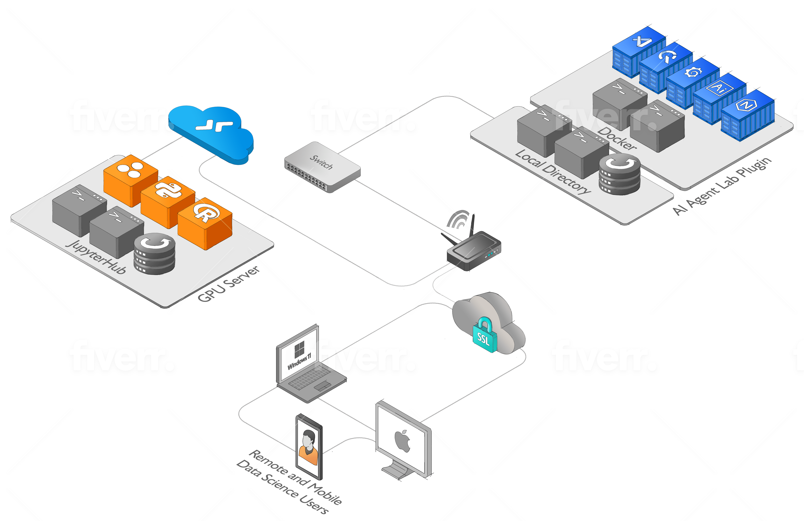

# AI Agent Lab

The AI Agent Lab is a module-based environment for working with the GPT-3.5 architecture, designed to facilitate rapid experimentation and testing of language models. The AI Agent Lab includes a docker-compose configuration with QuestDB, Grafana, Code-Server, Nginx and an AI Agent, providing a seamless interface for managing and querying data, visualizing results, and coding in real-time. With the AI Agent Lab, users can quickly set up a notebook environment and start experimenting with GPT-3.5 models, without the need for complex setup or configuration

The AI Agent Lab is also the basis for the AI Agent Farm, a modular system for developing and deploying AI agents. By using the AI Agent Lab as a module in the AI Agent Farm, users can easily connect their agents to real-time data streams and other sources of information, allowing for more sophisticated and accurate decision-making. With its flexible and modular design, AI-Agent-Lab is a powerful tool for anyone working with GPT-3.5 models and data streams in their AI applications.


To use AI Agent Lab with a remote JupyterHub environment, follow these steps:

- Set up or use an existing remote JupyterHub that includes the necessary dependencies for working with GPT-3.5 models and data streams.

- Launch the AI Agent Lab using the provided docker-compose file.

- Connect to the remote JupyterHub environment from within the Code-Server interface provided by AI-Agent-Lab.

Start working with GPT-3.5 models and data streams, using the pre-installed tools and libraries that are included in your remote environment.

## Features


1. **QuestDB**: QuestDB is a high-performance, open-source time-series database. It allows for efficient storage and querying of time-series data, making it ideal for working with real-time data streams.

2. **Grafana**: Grafana is a popular open-source platform for data visualization and monitoring. It provides a rich set of features for creating interactive dashboards and visualizing data from various sources.

3. **Code-Server**: Code-Server is a web-based IDE based on Visual Studio Code. It provides a familiar coding environment with features such as code completion, syntax highlighting, and debugging capabilities.

4. **Nginx**: Nginx is a widely-used web server and reverse proxy server. It enhances the AI Agent Lab by providing additional functionality for routing and load balancing, improving performance and security

5. **AI Agent**: The AI Agent is the core backend service in the AI Agent Lab, handling AI processing, data retrieval, and related operations. 

6. **AI Agent UI**: The AI Agent UI provides an intuitive, web-based interface for interacting with the AI agent. 


## Getting Started

To use the AI Agent Lab, follow these steps:

1. Set up or use an existing environment with [Docker](https://github.com/quantiota/AI-Agent-Farm/tree/master/doc/webapps/docker) installed.

2. Clone the AI Agent Lab repository and navigate to the docker directory.
```
git clone https://github.com/quantiota/AI-Agent-Lab.git
cd AI-Agent-Lab/docker

```

3. Follow all prerequisite steps that should be completed before bringing the  Docker Stack. Refer to the Docker [Readme](https://github.com/quantiota/AI-Agent-Lab/tree/main/docker) file for guidance


4. Launch the AI Agent Lab using the provided docker-compose configuration.

```
docker compose up --build -d

```

5. Once the services are up and running, you can access the AI Agent Lab interfaces:

- QuestDB: Visit https://questdb.domain.tld in your web browser.
- Grafana: Visit https://grafana.domain.tld in your web browser.
- Code-Server: Visit https://vscode.domain.tld in your web browser.
- AI Agent UI: Visit https://aigentui.domain.tld in your web browser.

6. To connect the AI Agent Lab to a remote JupyterHub environment from Code-Server:

- Set up or use an existing remote JupyterHub that includes the necessary dependencies for working with your notebooks and data.

- Connect to the remote JupyterHub environment from within the Code-Server interface provided by the AI Agent Lab

Start working with your notebooks and data, using the pre-installed tools and libraries that are included in your remote environment.


### AI Agent Lab Architecture Diagram

 


### Hardware Requirements

For optimal performance, the AI Agent Lab requires the following hardware setup:

- **Server**: HP Microserver Gen8
- **Processor**: Quad-core CPU
- **Primary Storage**: 250GB SSD
- **Memory**: 16GB of RAM
- **Controler**: HP Smart Array P410
- **Additional Storage**: 4x1TB RAID data storage
- **Operating System**: Ubuntu 22.04 Server


## References


- Connect to a JupyterHub from Visual Studio Code. [Visual Studio Code](https://code.visualstudio.com/docs/datascience/jupyter-notebooks#_connect-to-a-remote-jupyter-server)

- Create an API Token. [JupyterHub](https://jupyterhub.readthedocs.io/en/stable/howto/rest.html#create-an-api-token)

- [Visual Studio Code](https://code.visualstudio.com/)

- [QuestDB - The Fastest Open Source Time Series Database](https://questdb.io/)

- [Grafana - The open observability platform](https://grafana.com/)

- [Langchain](https://python.langchain.com)
 
- [MicroServer Gen8](https://www.storagereview.com/review/hp-proliant-microserver-gen8-review)