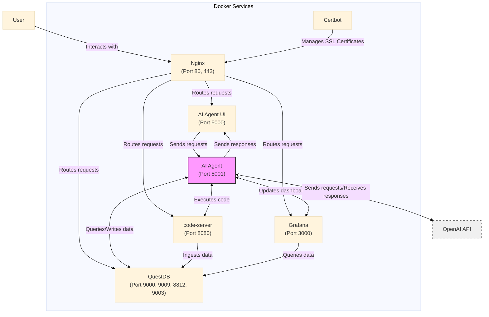

# Architecture Overview

## Architecture Diagram

The following diagram illustrates the architecture of the AI Agent lab:

## Architecture Highlights:
- **AI Agent**: The core AI service that processes user requests from the AI Agent UI. It interacts with various components:
  - **QuestDB**: Queries and writes data for storage and retrieval.
  - **Grafana**: Updates dashboards to visualize data and insights.
  - **code-server**: Executes code and scripts to perform tasks.
  - **OpenAI API**: Communicates with the external API for natural language processing and AI capabilities.

- **AI Agent UI**: A user-friendly interface (Flask-based) that allows users to interact with the AI Agent. It sends user requests to the AI Agent and displays the generated responses.

- **code-server**: An integrated development environment (IDE) accessible through the browser on port **8080**. It enables the AI Agent to execute code and scripts seamlessly.

- **Grafana**: A powerful data visualization platform that creates dashboards by querying data from QuestDB. The AI Agent updates these dashboards to provide real-time insights.

- **QuestDB**: A high-performance time-series database that serves as the central data storage for the AI Agent. It efficiently handles data querying and storage, interacting with both Grafana and the AI Agent.

- **OpenAI API**: An external API that provides advanced AI capabilities, such as natural language processing and generation. The AI Agent integrates with this API to enhance its functionality and performance.

- **Nginx**: A robust web server and reverse proxy that routes incoming user requests to the appropriate services, including the AI Agent UI, code-server, Grafana, and QuestDB.

- **Certbot**: An automated certificate management tool that simplifies the process of obtaining and renewing SSL certificates. It integrates with Nginx to enable secure communication over HTTPS.

## Sophistication of the Setup

### Key Features of the Setup:

1. **Distributed Architecture**:
   - The system uses multiple Docker containers, each running a distinct service (e.g., **AI Agent**, **AI Agent UI**, **code-server**, **QuestDB**, **Grafana**, **Nginx**, and **Certbot**). This separation of concerns increases modularity, fault tolerance, and scalability.

2. **Real-Time Data Processing**:
   - The inclusion of **code-server** for live data stream processing (database ingestion) and its interaction with **QuestDB** for real-time data storage and querying is a powerful feature. It enables dynamic data-driven applications where data is continuously processed and acted upon.

3. **Advanced Visualization**:
   - The connection between **QuestDB** and **Grafana** allows for real-time data visualization, making it easier to monitor and analyze the data ingested by the system. Grafana's dashboards give insights into the performance and health of the system.

4. **AI and NLP Integration**:
   - The **AI Agent**'s integration with **OpenAI API** brings natural language processing (NLP) capabilities to the system. This integration enables intelligent, context-aware interactions based on user inputs.

5. **Reverse Proxy and Security**:
   - **Nginx** serves as a reverse proxy, handling routing and load balancing, and ensures that all services are accessed securely. **Certbot** further enhances security by automating the management of SSL certificates, enabling HTTPS communication.

6. **Modular and Scalable Design**:
   - Each component (e.g., **code-server**, **QuestDB**, **AI Agent**, **Grafana**) is encapsulated within its own Docker container. This approach not only makes it easier to develop, test, and deploy but also provides a high degree of scalability. You can scale individual components independently based on their specific workloads.

7. **Data-Driven and Code Execution**:
   - The dual role of **code-server** — both as a development environment and as a processor for live data ingestion — adds versatility. It supports dynamic data ingestion and task execution, critical for use cases that require fast, real-time processing.

### Sophistication Factors:

- **Inter-service communication**: The setup allows multiple services to communicate seamlessly with each other, and the use of **Nginx** simplifies routing between the user and backend services.
- **Live data handling**: The real-time data processing and ingestion via **code-server** with visualization in **Grafana** make it sophisticated and powerful for data-intensive applications.
- **Security**: With **Nginx** and **Certbot**, the system ensures that all user interactions are encrypted and secure, adding to the sophistication.
- **AI and Data Flow**: The AI Agent's capability to process user inputs through an advanced NLP system (like OpenAI API) while querying databases and visualizing data is a highly integrated and advanced setup.

### The Importance of a Simple Foundation:

Although this architecture is sophisticated and powerful, it's critical to recognize the importance of building a simple and solid foundation. By starting with a more streamlined and modular base, each component can be tested, validated, and optimized individually. This simplicity ensures that as the system grows in complexity, it remains stable, easy to maintain, and scalable. With a well-defined foundational architecture, adding new features or expanding the system becomes more efficient, reducing the risk of technical debt and making it easier to build additional layers on top without reworking the core. In essence, a simpler foundation allows for faster development cycles and greater long-term flexibility.

### Use Cases:

This kind of setup is ideal for **complex AI-driven applications**, **real-time data monitoring**, **machine learning pipelines**, **financial analytics**, and **interactive AI systems** where live data needs to be processed, queried, and visualized continuously.

---

### In Summary:

This architecture is **sophisticated** due to its modularity, real-time processing capabilities, security, AI integration, and flexibility, making it well-suited for advanced data-centric and AI applications.

