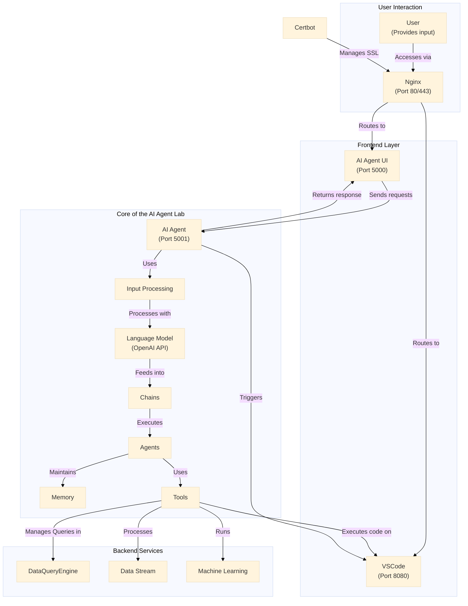

## Build LangChain Diagram

### Instructions:
1. **File**: Use the `langchain-diagram.md` file as the destination for the diagram.
2. **Source**: Refer to the **SOTA** folder in `sota-summary.pdf` to build the LangChain diagram.
3. **Diagram Format**: The diagram should include key components such as:
   - **Input Processing**
   - **Language Models (LLM)** such as OpenAI
   - **Chains** for sequential operations
   - **Agents** for dynamic decision-making
   - **Memory** for conversational context
   - **Tools** (databases, APIs, etc.)
   - Any **external APIs or databases** mentioned in the SOTA summary.
   
### Example Structure:

### Developed Structure:

This diagram outlines a multi-tiered architecture that begins with user interaction through a classic frontend managed by Nginx. User requests are routed to various services such as the AI Agent UI, VSCode, Grafana, and QuestDB. 

The AI workflow involves an AI Agent processing user inputs with language models, chaining operations through agents that maintain memory and use various tools. These tools, in turn, interact with backend and frontend services like VSCode, QuestDB, Grafana, data streams, and machine learning components. 

Additional interactions ensure continuous updates, data storage, and security management via Certbot handling SSL through Nginx, showcasing a comprehensive system integration from user input to sophisticated AI and backend processing.

### Partial Structure with QuestDB
This updated diagram retains only the components and connections related to QuestDB 

### Partial Structure with Grafana
This updated diagram retains only the components and connections related to Grafana

### Partial Structure with Vscode

This updated diagram retains only the components and connections related to Vscode

### Core of the AI Agent Lab

The Core of the AI Agent Lab is meticulously designed with a modular architecture, ensuring flexibility and ease of integration with external services such as QuestDB, Grafana, and VSCode with minimal modifications. At its heart lies the AI Agent, which processes incoming requests through the Input Processing module. This module leverages a Language Model (e.g., OpenAI API) to interpret and generate meaningful responses. 

The processed data then flows into Chains, which orchestrate the workflow by directing tasks to specialized Agents. These Agents are responsible for executing specific functions, maintaining contextual Memory, and utilizing various Tools.

The modularity of the core is achieved by abstracting the interactions with external services into the Tools component. This design allows each tool—whether it be QuestDB for robust data management, Grafana for dynamic data visualization, or VSCode for code execution and development—to be integrated independently. By encapsulating the logic for each external service within its respective tool module, the core remains untouched when adding or updating integrations. 

This separation of concerns not only simplifies the development and maintenance process but also enhances the scalability of the AI Agent Lab. Consequently, developers can extend the system's capabilities by incorporating new tools or modifying existing ones without altering the foundational AI workflows, thereby fostering a versatile and resilient AI ecosystem.

