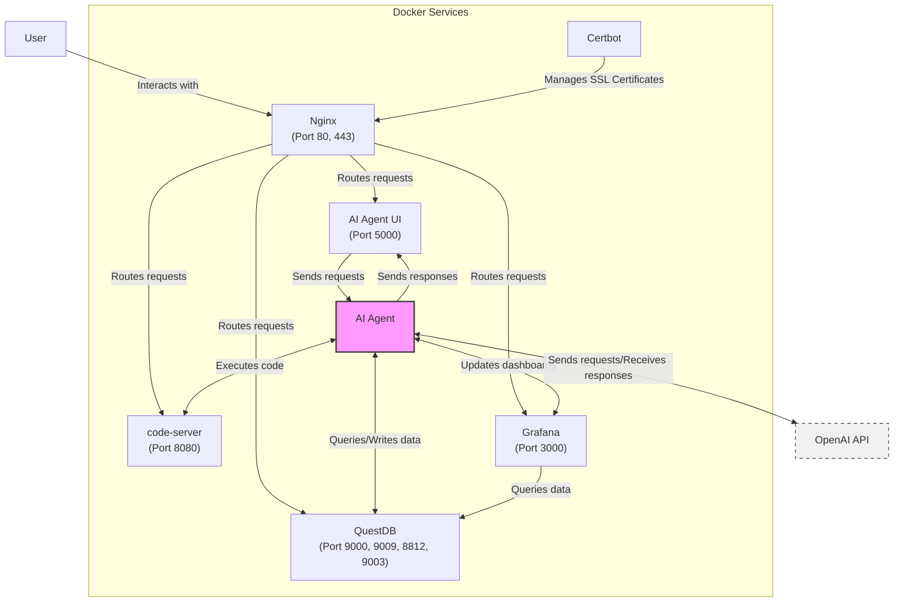

# Architecture Overview

The following diagram illustrates the architecture of the AI Agent lab:

## Architecture Highlights:
- **AI Agent**: The main AI service that handles requests from the AI Agent UI and interacts with **QuestDB**, **Grafana**, and **code-server**. It also communicates with the **OpenAI API** for natural language processing tasks.
- **AI Agent UI**: The user interface (Flask-based), handling user requests and returning AI Agent responses.
- **code-server**: Added as a service running on port **8080**, allowing the AI Agent to execute code.
- **Grafana**: Visualizes data by querying QuestDB, with updates handled by the AI Agent.
- **QuestDB**: The core database for querying and storing data, interacting with both Grafana and the AI Agent. 
- **OpenAI API**: External API for AI capabilities, like generating responses based on user input, integrated with the AI Agent.
- **Nginx**: Acts as a reverse proxy, routing user requests to **AI Agent UI**, **code-server**, **Grafana**, and **QuestDB**.
- **Certbot**: Manages SSL certificates for secure communication, integrated with Nginx.

