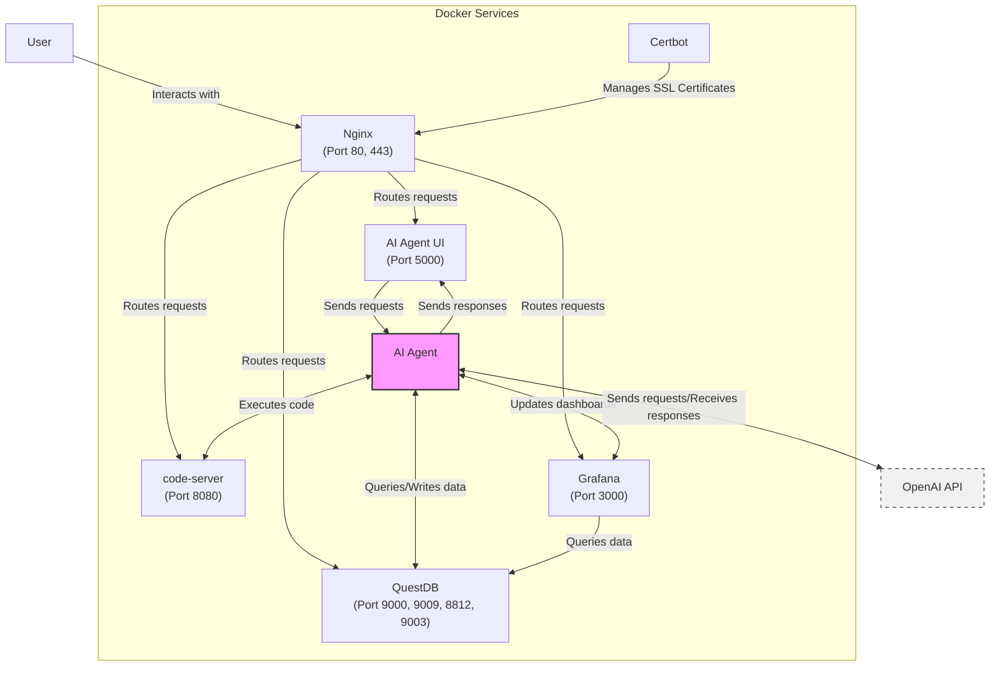

# Architecture Overview

## Architecture Diagram

The following diagram illustrates the architecture of the AI Agent lab:

## Architecture Highlights:
- **AI Agent**: The core AI service that processes user requests from the AI Agent UI. It interacts with various components:
  - **QuestDB**: Queries and writes data for storage and retrieval.
  - **Grafana**: Updates dashboards to visualize data and insights.
  - **code-server**: Executes code and scripts to perform tasks.
  - **OpenAI API**: Communicates with the external API for natural language processing and AI capabilities.

- **AI Agent UI**: A user-friendly interface (Flask-based) that allows users to interact with the AI Agent. It sends user requests to the AI Agent and displays the generated responses.

- **code-server**: An integrated development environment (IDE) accessible through the browser on port **8080**. It enables the AI Agent to execute code and scripts seamlessly.

- **Grafana**: A powerful data visualization platform that creates dashboards by querying data from QuestDB. The AI Agent updates these dashboards to provide real-time insights.

- **QuestDB**: A high-performance time-series database that serves as the central data storage for the AI Agent. It efficiently handles data querying and storage, interacting with both Grafana and the AI Agent.

- **OpenAI API**: An external API that provides advanced AI capabilities, such as natural language processing and generation. The AI Agent integrates with this API to enhance its functionality and performance.

- **Nginx**: A robust web server and reverse proxy that routes incoming user requests to the appropriate services, including the AI Agent UI, code-server, Grafana, and QuestDB.

- **Certbot**: An automated certificate management tool that simplifies the process of obtaining and renewing SSL certificates. It integrates with Nginx to enable secure communication over HTTPS.

Tasks for Intern To Do

## LangChain Integration Diagram

## LangChain-Specific Components: