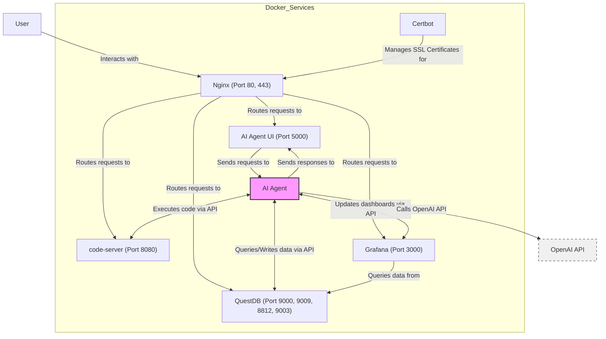

# AI Agent Lab

This project is an AI Agent lab environment using Docker services. It includes components for development (code-server), data storage (QuestDB), visualization (Grafana), and an AI Agent UI, all orchestrated with Docker Compose.

## Architecture Overview

The following diagram illustrates the architecture of the AI Agent lab:

## Components

- **Nginx**: Acts as a reverse proxy, routing requests to the appropriate services.
- **AI Agent UI**: The user interface for interacting with the AI Agent.
- **AI Agent**: (To be developed) The core component that processes data and interacts with other services via their APIs.
- **QuestDB**: A time-series database for storing and querying data.
- **Grafana**: A platform for monitoring and observability.
- **code-server**: A browser-based IDE for coding and script execution.
- **Certbot**: Manages SSL certificates for secure HTTPS connections.

## AI Agent Development

The main focus for development is the AI Agent component. This component will:

1. Interact with the AI Agent UI to receive requests and send responses.
2. Communicate with other services using their respective APIs:
   - **QuestDB API**: For querying and writing time-series data.
   - **Grafana API**: For creating and updating dashboards programmatically.
   - **code-server API**: For executing code or scripts remotely.
3. Connect to external APIs for enhanced functionality:
   - **OpenAI API**: For natural language processing and generation tasks.
   - **Custom API 1**: (Describe the purpose of this API)
   - **Custom API 2**: (Describe the purpose of this API)

When developing the AI Agent, consider the following:

- Implement robust error handling for all API calls and data processing operations.
- Ensure efficient data management with QuestDB, including proper indexing and query optimization.
- Design clear and informative Grafana dashboards for real-time monitoring of the AI Agent's performance and outputs.
- Utilize code-server for dynamic code execution and potential automated updates to the AI Agent itself.
- Develop a modular architecture that allows for easy integration of additional APIs or services in the future.

## API Integration Guidelines

When integrating with the various APIs, keep the following in mind:

1. **QuestDB API**: 
   - Use the appropriate client library or HTTP API endpoints for efficient data insertion and querying.
   - Implement connection pooling and error handling for robust database interactions.

2. **Grafana API**:
   - Utilize the Grafana HTTP API to programmatically create and update dashboards.
   - Consider implementing a caching mechanism to avoid excessive API calls.

3. **code-server API**:
   - Use the code-server API to execute code remotely and retrieve results.
   - Implement proper security measures to prevent unauthorized code execution.

4. **External APIs** (OpenAI, Custom API 1, Custom API 2):
   - Implement rate limiting and error handling to manage API usage effectively.
   - Use asynchronous programming techniques for improved performance when making multiple API calls.

## Getting Started

(Add instructions for setting up and running the project using Docker Compose)

## Contributing

(Add guidelines for contributing to the project)

## License

(Add license information)