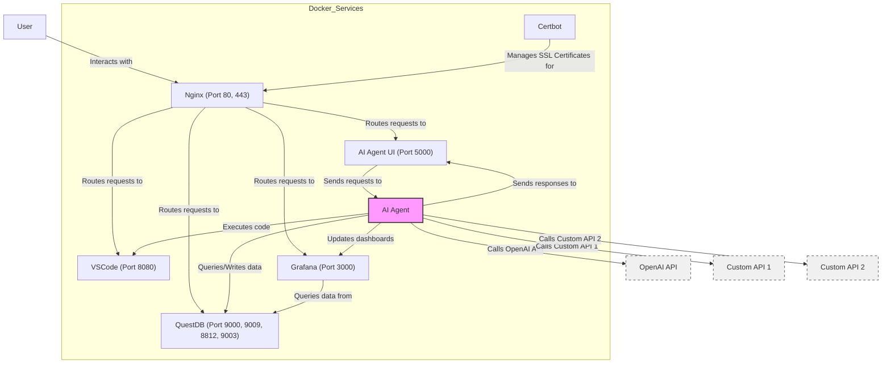

## Architecture Overview

The following diagram illustrates the architecture of the AI Agent lab:

```mermaid
graph TD
    subgraph Docker_Services
        vscode["VSCode (Port 8080)"]
        grafana["Grafana (Port 3000)"]
        questdb["QuestDB (Port 9000, 9009, 8812, 9003)"]
        aiagentui["AI Agent UI (Port 5000)"]
        nginx["Nginx (Port 80, 443)"]
        certbot["Certbot"]
        aiagent["AI Agent"]
    end
    User -->|Interacts with| nginx
    nginx -->|Routes requests to| aiagentui
    nginx -->|Routes requests to| vscode
    nginx -->|Routes requests to| grafana
    nginx -->|Routes requests to| questdb
    aiagentui -->|Sends requests to| aiagent
    aiagent -->|Sends responses to| aiagentui
    aiagent -->|Queries/Writes data| questdb
    aiagent -->|Updates dashboards| grafana
    aiagent -->|Executes code| vscode
    grafana -->|Queries data from| questdb
    certbot -->|Manages SSL Certificates for| nginx
    
    aiagent -->|Calls OpenAI API| OpenAI["OpenAI API"]
    aiagent -->|Calls Custom API 1| API1["Custom API 1"]
    aiagent -->|Calls Custom API 2| API2["Custom API 2"]
    
    classDef toDevelop fill:#f9f,stroke:#333,stroke-width:2px;
    class aiagent toDevelop;
    classDef external fill:#f0f0f0,stroke:#333,stroke-dasharray: 5 5;
    class OpenAI,API1,API2 external;
```