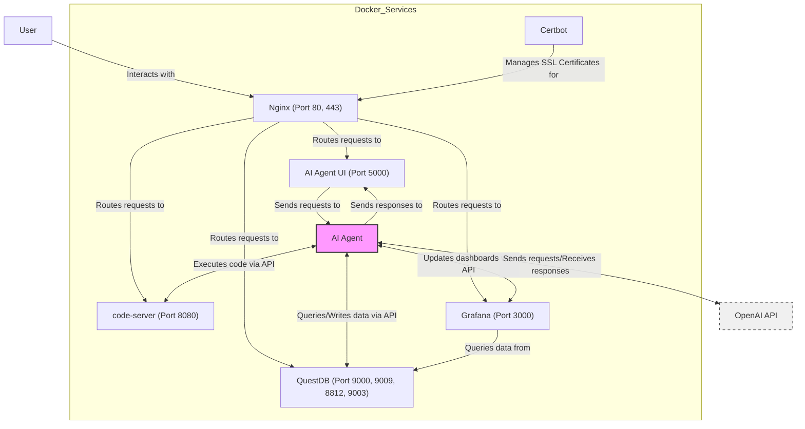

# Architecture Overview

The following diagram illustrates the architecture of the AI Agent lab:

## Components

- **Nginx**: Acts as a reverse proxy, routing requests to the appropriate services.
- **AI Agent UI**: (To be developed) The user interface for interacting with the AI Agent.
- **AI Agent**: (To be developed) The core component that processes data and interacts with other services via their APIs.
- **QuestDB**: A time-series database for storing and querying data.
- **Grafana**: A platform for monitoring and observability.
- **code-server**: A browser-based IDE for coding and script execution.
- **Certbot**: Manages SSL certificates for secure HTTPS connections.

## AI Agent Development

The main focus for development is the AI Agent component. This component will:

1. Interact with the AI Agent UI to receive requests and send responses.
2. Communicate with internal services using their respective APIs:
   - **QuestDB API**: For querying and writing time-series data.
   - **Grafana API**: For creating and updating dashboards programmatically.
   - **code-server API**: For executing code or scripts remotely.
3. Interact with external APIs for enhanced functionality:
   - **OpenAI API**: For natural language processing and generation tasks.

When developing the AI Agent, consider the following:

- Implement robust error handling for all API calls and data processing operations.
- Ensure efficient data management with QuestDB, including proper indexing and query optimization.
- Design clear and informative Grafana dashboards for real-time monitoring of the AI Agent's performance and outputs.
- Utilize code-server for dynamic code execution and potential automated updates to the AI Agent itself.
- Develop a modular architecture that allows for easy integration of additional APIs or services in the future.
  
  
## AI Agent UI Development

The AI Agent UI serves as the primary interface for users to interact with the AI Agent. When developing the UI, consider the following:

- Design an intuitive and user-friendly interface that allows users to easily input requests and view responses from the AI Agent.
- Implement real-time updates to display the AI Agent's processing status and any relevant outputs.
- Ensure the UI is responsive and compatible with various devices and screen sizes.
- Integrate with the AI Agent backend using appropriate API endpoints for seamless communication.
- Implement error handling and user feedback mechanisms to provide a smooth user experience.

## API Integration Guidelines

When integrating with the various APIs, keep the following in mind:

1. **Internal APIs (QuestDB, Grafana, code-server)**:
   - Use appropriate client libraries or HTTP API endpoints for efficient communication.
   - Implement connection pooling and error handling for robust interactions.
   - Consider implementing caching mechanisms to optimize performance.

2. **External APIs (OpenAI)**:
   - Implement rate limiting and error handling to manage API usage effectively.
   - Use asynchronous programming techniques for improved performance when making multiple API calls.
   - Ensure proper security measures for handling API keys and sensitive data.

For all APIs:
- Log API interactions for debugging and monitoring purposes.
- Implement retry mechanisms with exponential backoff for handling temporary failures.
- Use appropriate authentication methods as required by each API.

