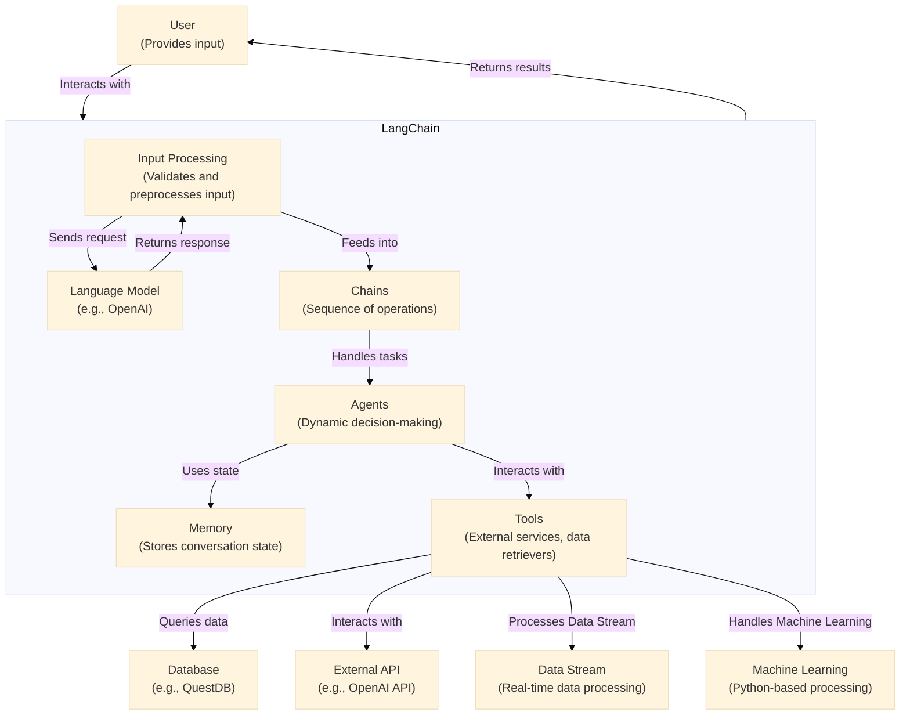

# Langchain Diagram

```mermaid
---
config:
  look: classic
  theme: base
  layout: dagre
---
graph TD
User["User<br>(Provides input)"] -->|Interacts with| LangChain
subgraph LangChain
InputProcessing["Input Processing<br>(Validates and preprocesses input)"]
LLM["Language Model<br>(e.g., OpenAI)"]
Chains["Chains<br>(Sequence of operations)"]
Agents["Agents<br>(Dynamic decision-making)"]
Memory["Memory<br>(Stores conversation state)"]
Tools["Tools<br>(External services, data retrievers)"]
end

InputProcessing -->|Sends request| LLM
LLM -->|Returns response| InputProcessing
InputProcessing -->|Feeds into| Chains
Chains -->|Handles tasks| Agents
Agents -->|Uses state| Memory
Agents -->|Interacts with| Tools
Tools -->|Queries data| Database["Database<br>(e.g., QuestDB)"]
Tools -->|Interacts with| ExternalAPI["External API<br>(e.g., OpenAI API)"]
Tools -->|Processes Data Stream| DataStream["Data Stream<br>(Real-time data processing)"]
Tools -->|Handles Machine Learning| ML["Machine Learning<br>(Python-based processing)"]
LangChain -->|Returns results| User
```